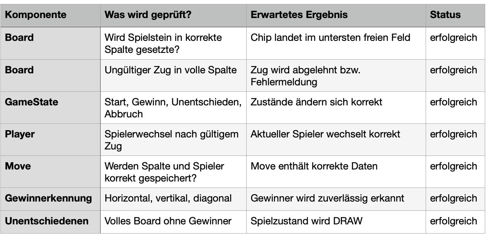
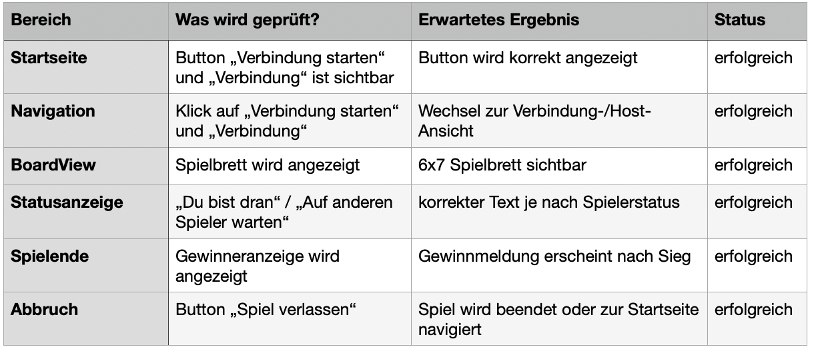
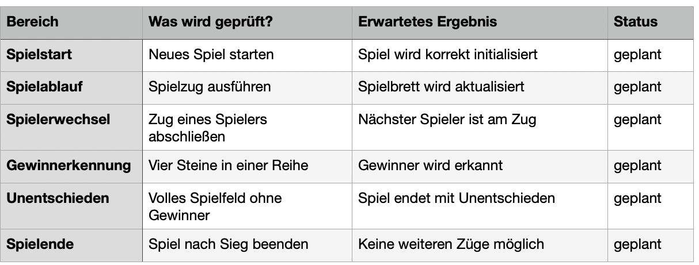

Hinweis: Dieses Projekt befindet sich noch in Entwicklung. Die Anwendung ist grundsätzlich funktionsfähig, der Code wird jedoch weiterhin überarbeitet, optimiert und dokumentiert. Daher können sich Struktur, Implementierung und einzelne Funktionen noch ändern.

## Beschreibung
Dieses Projekt setzt das bekannte Spiel 4 Gewinnt als Android-App um. Die App wird mit Kotlin in Android Studio entwickelt.

Zwei Spieler treten gegeneinander an. Jeder Spieler verwendet Chips in einer eigenen Farbe. Pro Runde wirft ein Spieler einen Chip in eine Spalte des Spielfelds. Der Chip fällt automatisch auf die tiefste freie Position der jeweiligen Spalte.

Gewonnen hat der Spieler, der zuerst vier eigene Chips in einer Reihe platziert. Diese Reihe kann horizontal, vertikal oder diagonal verlaufen.

Die beiden Spieler sollen über Bluetooth miteinander verbunden werden können. Spielzüge werden zwischen den Geräten übertragen und auf beiden Geräten synchron dargestellt.

## Geplante Funktionen
- Spielstart zwischen zwei Spielern
- Verbindung über Bluetooth
- Echtzeitübertragung von Spielzügen
- Automatischer Spielerwechsel
- Gewinnerkennung
- Erkennung eines Unentschiedens
- Spiel verlassen bzw. Spiel abbrechen

 ## Teststrategie

### Model-Komponenten JUnit-Tests
Für die Model-Komponenten Board, GameState, Player, Move und Chip sind lokale JUnit-Tests geplant. Dabei werden Spiellogik, gültige und ungültige Spielzüge, Spielerwechsel, Gewinnerkennung und Unentschieden geprüft.

### Compose UI Tests
Für die UI sind Compose UI Tests geplant. Dabei wird getestet, ob zentrale Elemente wie Buttons, Spielbrett und Statusanzeigen sichtbar sind und ob Klicks korrekt verarbeitet werden.

### Bluetooth-Komponente Test
Die Bluetooth-Komponente wird nicht direkt mit echter Hardware automatisiert getestet. Da für die Entwicklung keine zwei Android-Geräte zur Verfügung standen, wurden für die Tests Mock-Objekte verwendet.
Dadurch kann überprüft werden, ob die Bluetooth-Komponente korrekt auf Verbindungsaufbau, gesendete Spielzüge, empfangene Spielzüge sowie ungültige Nachrichten reagiert.
Zusätzlich wurde ein FakeBluetoothHandler implementiert, um den Spielverlauf ohne echte Bluetooth-Verbindung testen zu können. Dieser simuliert einen zweiten Spieler und ermöglicht es, Spielzüge und Zustandsänderungen innerhalb der App zu überprüfen.

### Integrationtests
Der gesamte Spielablauf wird zusätzlich mit Integrationstests geprüft, z. B. Spiel starten,
Zug ausführen, Spieler wechseln und Spielende erkennen

